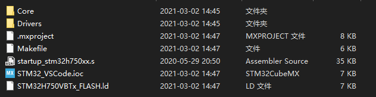
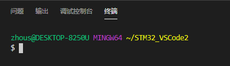

# VSCode开发STM32


参考：[用VS Code开发STM32](https://zhuanlan.zhihu.com/p/61519415)

# 0. 写在前面

本文了搭建一个用**VSCode + 开源 arm 工具链 + OpenOCD**开发STM32的环境。本文以Windows 10为例进行配置。

**以下所有的路径都最好不要有中文。**


# 1. 软件安装

## 1.1 需要的软件和工具

(1) [STM32CubeMX](https://www.stm32cube.com/)：用于生成带makefile的HAL库工程（给的链接是国内的论坛，因为官网下载太麻烦了还要注册账号）。注意STM32CubeMX是依赖Java的，所以要确保你电脑上安装了[JRE](https://www.oracle.com/java/technologies/javase-jre8-downloads.html)（Ubuntu用sudo apt install default-jre来安装）；

(2) [VSCode](https://code.visualstudio.com/)：很好用的编辑器，现在已经有64位的版本；

(3) [GNU Arm Embedded Toolchain](https//developer.arm.com/tools-and-software/open-source-software/developer-tools/gnu-toolchain/gnu-rm/downloads)：arm用的GNU工具链，包括编译器(gcc)，调试器(gdb），链接器(ld)和其它工具。

(4) [OpenOCD ( windows版 )](https://gnutoolchains.com/arm-eabi/openocd/)：一个开源的片上调试器(Open On-Chip Debugger)。

(5) [Zadig](https://zadig.akeo.ie/)：用来装jlink 的USB驱动的，虽然Jlink插上就能装驱动，但是直接装的OpenOCD识别不到。****

(6) [Git](https://git-scm.com/)：git版本管理不用多介绍了吧，但是我们这里要使用的是下载git附带的git bash。

不使用mingw的原因是，mingw有时会安装失败，很烦。


## 1.2 安装

STM32CubeMX、ARM工具链、VS Code、Git都是安装包，默认安装即可。Zadig是免安装，就不说了。

OpenOCD直接下载编译好的可执行文件，Windows戳[<这个链接>](https:gnutoolchains.com/arm-eabi/openocd/)，解压，将文件夹拷贝至以下路径。


Git要使用git附带的git bash。这个bash是基于mingw的，非常轻量，没有make，**给git bash增加make，wget等工具的方法，见[这篇文章](https://blog.csdn.net/z69183787/article/details/96290717)。**

- 到 https://sourceforge.net/projects/ezwinports/files/ 去下载[make-4.3-without-guile-w32-bin.zip](https://sourceforge.net/projects/ezwinports/files/make-4.3-without-guile-w32-bin.zip/download) 这个文件。
- 把该文件进行解压
- 把解压出来的文件全部拷贝的git的安装目录下：“C:\Program Files\Git\mingw64”，把文件夹进行合并，如果跳出来需要替换的文件要选择不替换。
- 
- 这样在git bash窗口下就可以使用make了
- 

## 1.3 设置环境变量

把Arm工具链安装目录下的bin文件夹和openOCD安装目录下的bin文件夹都添加到PATH环境变量中。


添加完后，重启电脑，在Win命令行和git bash中分别测试，若看到版本信息则说明设置成功。


```shell
zhous@DESKTOP-8250U MINGW64 /c
$ arm-none-eabi-gcc --version
arm-none-eabi-gcc.exe (GNU Arm Embedded Toolchain 10-2020-q4-major) 10.2.1 20201103 (release)
Copyright (C) 2020 Free Software Foundation, Inc.
This is free software; see the source for copying conditions.  There is NO
warranty; not even for MERCHANTABILITY or FITNESS FOR A PARTICULAR PURPOSE.


zhous@DESKTOP-8250U MINGW64 /c
$ openocd --version
Open On-Chip Debugger 0.10.0 (2020-12-28) [https://github.com/sysprogs/openocd]
Licensed under GNU GPL v2
libusb1 09e75e98b4d9ea7909e8837b7a3f00dda4589dc3
For bug reports, read
        http://openocd.org/doc/doxygen/bugs.html

```


## 1.4 使用Zadig修改J-link驱动

插上Jlink，自动安装完驱动后，打开设备管理器，是这样的


“**通用串行总线控制器**”，OpenOCD识别不到。

插上Jlink后，打开Zadig，选择"Options"---"List All Devices"，下拉菜单中选择"J-link"，然后在右侧选择"WinUSB"，点击Reinstall Driver。


打开设备管理器，就看到J-link从**“通用串行总线控制器”**变成了**“通用串行总线设备”**。这样就修改完成了。


# 2. 创建工程及编译

## 2.1 用STM32CubeMX创建工程

### 2.1.1 安装支持包

主页右边可以安装不同芯片的支持包，例如F1系列，F4系列，H7系列

### 2.1.2 新建项目

通用配置这里不做说明，只说不同的。

**Debug口：** Pinout & Configuration - Trace and Debug - DEBUG - Debug:Serial Wire


**项目配置:** Project Manager - Project， “Toolchain/IDE”选择生成makefile即可


**代码生成器配置：**Project Manager - Code Generator， 勾选选项。


### 2.1.3 生成代码

点击右上角的GENERATE CODE生成代码。



## 2.2 配置VS Code

用VS Code打开工程文件夹，你将会看到这样的目录结构:


### 2.2.1. 安装VS Code 插件

按 F1 输入 extensions:


在插件商店搜索即可，需要这几样：

- **Chinese (Simplified)**：VS Code的语言支持是以插件形式存在的，需要装个中文插件;
- **C/C++**：提供代码补全、智能感知和debug功能；

（注意，VSCode 可能会推荐你安装C/C++ Intellisense插件来做智能感知 ，但它依赖于GNU Global工具，我们的arm工具链里没有这个，所以不用装）；

- **C/C++ Snippets**：好用的代码模板小工具。比如说，装好以后，敲个for，就可以自动补全整个for循环代码；
- **ARM**：提供ARM汇编语言的代码高亮；
- **Cortex-Debug**：本教程的核心，有了它，才能把ARM工具链和OpenOCD等命令行工具组织到VSCode中，并进行图形化操作。

### 2.2.2 配置VS Code内置终端

"文件"--"首选项"--"设置"，搜索"Terminal > Integtated > Shell: Windows"，设置内置终端的Shell为git bash（之前的默认是power shell）。


```json
"terminal.integrated.shell.windows": "C:\\Program Files\\Git\\bin\\bash.exe"
```

保存json文件，使用快捷键“Ctrl + `”，打开终端



【注】如果你只想在开发STM32的时候用bash，可以只在当前目录下新建一个.vscode文件夹，然后新建一个单独的settings.json，在里面写上：

```json
{
    "terminal.integrated.shell.windows": "C:\\Program Files\\Git\\bin\\bash.exe"
}
```

这就是只在这个文件夹内生效的配置了，会覆盖掉全局的配置。

此时在终端里使用“make”命令就可以编译成功了


### 2.2.3 配置智能感知

打开代码，编辑窗口里会给我们亮一堆红点，代码里给我们一堆红色波浪线。VS Code认为语法有错误，下面解决。

在通过Makefile组织的项目中，通过gcc的-D参数在编译时添加了两个宏定义。但是，**VS Code只是一个编辑器**，它检查代码的时候并不会去读makefile，而是只看.h和.c文件，所以语法会有错误。但Make时没问题。


使用c_cpp_properties.json配置文件，用来告诉VS Code我们定义了这些宏。

a. 随便找到一处红色波浪线，点击并把光标移到那一行，左上角会出现一个黄色小灯泡。点击黄色小灯泡并选择“编辑‘includePath设置’”。


修改文件内容如下(文件中绝对路径的内容与实际安装路径匹配)，[c_cpp_properties.json](./c_cpp_properties.json)

```json
{
    "configurations": [
        {
            "name": "Win32",
            "includePath": [
                "C:/Program Files (x86)/GNU Arm Embedded Toolchain/10 2020-q4-major/arm-none-eabi/include",
                "${workspaceFolder}/Core/**",
                "${workspaceFolder}/Core/Inc",
                "${workspaceFolder}/Drivers/STM32H7xx_HAL_Driver/Inc",
                "${workspaceFolder}/Drivers/STM32H7xx_HAL_Driver/Inc/Legacy",
                "${workspaceFolder}/Drivers/CMSIS/Device/ST/STM32H7xx/Include",
                "${workspaceFolder}/Drivers/CMSIS/Include",
                "${workspaceFolder}/Drivers/CMSIS/Include"
            ],
            "defines": [
                "_DEBUG",
                "UNICODE",
                "_UNICODE",
                "USE_HAL_DRIVER",
                "STM32H750xx"
            ],
            "compilerPath": "C:/Program Files (x86)/GNU Arm Embedded Toolchain/10 2020-q4-major/bin/arm-none-eabi-gcc.exe",
            "cStandard": "c11",
            "cppStandard": "c++17",
            "intelliSenseMode": "gcc-x64",
            "browse": {
                "limitSymbolsToIncludedHeaders": true,
                "databaseFilename": "",
                "path": [
                    "${workspaceFolder}"
                ]
            }
        }
    ],
    "version": 4
}
```

- “name”：这是用于标记使用的平台的标签。除了win32还可以选Linux或Mac。也就是说，这个json里“configuration“下可以写三组配置，只要每组配置前面写上不同的平台，即可在不同的操作系统上使用就会自动适配不同的配置，非常方便
- "includePath"：告诉VS Code该去哪里查找头文件。第一个目录是C语言标准库的目录， 剩下的几个目录直接从Makefile里复制然后稍微修改下即可。`"${workspaceFolder}"`表示项目文件夹；
- ”defines“：全局宏定义，告诉VS Code这些宏都被定义了，只是没写在源码中而已。上述多加的两个宏是makefile里的。
- "compilerPath"：指定编译器的路径。**因为有一些宏是编译器自带的，连makefile里都没有**，例如`__GNUC__`。有些教程里会让你在defines里面加上`__GNUC__`，但是这是没必要的。只要你指定了编译器路径，所有的编译器自带的宏就都导入了VS Code。
- "intelliSenseMode"：因为我们用的是gcc所以选gcc-x64
- "browse.path"：源文件搜索路径。据说是用来做代码补全和查找定义的，但是我测试后发现删去也不影响使用，不过还是留着吧。这个路径和includePath不同，browse.path是自动递归所有子目录的。而include.path默认只看本目录。

保存json文件后，所有警告消失。

### 2.2.4 配置build任务

直接在终端里敲一个make，就会根据makefile的内容，在当前目录下创建一个build文件夹，在里面生成每个源文件生成的.o文件，以及最终链接得到的elf文件（用于调试），以及用于直接下载用的十六进制文件(.hex)和二进制文件(.bin)。

为了方便后面的操作，我们在.vscode目录下创建**tasks.json**文件(文件名里别少了s！)，内容如下：

```json
{
    // See https://go.microsoft.com/fwlink/?LinkId=733558
    // for the documentation about the tasks.json format
    "version": "2.0.0",
    "tasks": [
        {
            "label": "编译",
            "type": "shell",
            "command": "make -j4",
            "problemMatcher": [],
            "group": {
                "kind": "build",
                "isDefault": true
            }
        },
        {
            "label": "编译并下载",
            "type": "shell",
            "command": "make -j4 && make update",
            "problemMatcher": []
        },
        {
            "label": "重新编译",
            "type": "shell",
            "command": "make clean && make -j4",
            "problemMatcher": []
        },
        {
            "label": "清理",
            "type": "shell",
            "command": "make",
            "args": [
                "clean"
            ] 
        },
        {
            "label": "复位设备",
            "type": "shell",
            "command": "STM32_Programmer_CLI -c port=SWD -hardRst",
            "problemMatcher": []
        }
    ]
}
```

这个文件创建了几个任务，

- 编译任务就是在bash里执行了make -j4

- 编译下载任务就是在bash里执行了make -j4 && make update

- 重新编译任务就是在bash里执行了make clean && make -j4

- 清理任务就是在bash里执行了make clean

  

VS Code是可以给任务绑定快捷键的，具体就不介绍了，有兴趣可以自己搜索。
不使用快捷键而执行task的方法：按Ctrl + P，然后输入”task[空格]“，就会出现可用的任务列表。

至此，编译的部分已经完成，下一部分是调试。


# 3. 在线调试

## 3.1 Openocd配置

在项目文件夹下新建一个openocd.cfg文件，内容如下

```cfg
# 选择调试器为jlink
source [find interface/jlink.cfg]
#source [find interface/cmsis-dap.cfg]

# 选择接口为SWD
transport select swd

# 选择目标芯片
source [find target/stm32h7x.cfg]
```


Openocd启动时，会自动在当前目录下寻找名为openocd.cfg的文件作为配置文件。

本配置文件中引用到的其他配置文件，都在openocd安装目录下的share/openocd/scripts目录下。其中interface目录下都是接口相关配置文件、target目录下都是芯片相关的配置文件。

## 3.2 下载svd文件

在[<这个链接>](https://github.com/posborne/cmsis-svd)寻找STM32H750x的svd文件。CMSIS-SVD是CMSIS的一个组件，它包含完整微控制器系统（包括外设）的程序员视图的系统视图描述 XML 文件。简单来说，**VS Code可以通过它来知道外设寄存器的地址分布，从而把寄存器内容展示到窗口中**。

下载好的STM32H750x.svd文件放在项目文件夹根目录即可。


## 3.3 配置VS Code的调试功能

在.vscode文件夹中新建一个launch.json，内容如下：

```json
{
    // 使用 IntelliSense 了解相关属性。 
    // 悬停以查看现有属性的描述。
    // 欲了解更多信息，请访问: https://go.microsoft.com/fwlink/?linkid=830387
    "version": "0.2.0",
    "configurations": [
        
        {
            "name": "Cortex Debug",
            "cwd": "${workspaceRoot}",
            "executable": "${workspaceRoot}/build/${workspaceFolderBasename}.elf",
            "request": "launch",
            "type": "cortex-debug",
            
            //使用J-link GDB Server时必须；其他GBD Server时可选（有可能帮助自动选择SVD文件）。支持的设备见 https://www.segger.com/downloads/supported-devices.php
            "device":"STM32H750VB", 
            //svd文件，有这个文件才能查看寄存器的值，每个单片机都不同。可以在以下地址找到 https://github.com/posborne/cmsis-svd       
            "svdFile": "${workspaceRoot}/STM32H750x.svd", 
            "servertype": "openocd",       //使用的GDB Server
            "configFiles": [                  
                "${workspaceRoot}/openocd.cfg"
            ],
            "preLaunchTask": "编译",        // 此处与设置Task一致
            "armToolchainPath": "C:/Program Files (x86)/GNU Arm Embedded Toolchain/10 2020-q4-major/bin/"
        
        }
    ]
}
```

- "executable"：编译出的二进制文件，也就是最终烧录到单片机中的，这里是elf文件。根据芯片的不同，可能产生不同的名称和后缀（例如TI的TM4C123芯片编译出来的名称是"main.axf"）
- "request"：可以选launch或attach。launch是指启动调试时同时开始执行程序；attcah是指程序已经在运行了，然后开始调试。我没测试过attach。
- "type"：调试的类型，选cortex-debug，这是我们装的插件。其实也可以填cppdbg之类的，但是那样我们就得自己配置gdb了，配置起来将会非常麻烦。
- "device"：目标芯片。如果你使用J-LINK GDB Server时必须要设置这个选项。然而我们的GDB Server是openocd，J-Link只用来连接芯片。
- "svdFile"：svd文件的路径。
- "servertype"：要选择的gdb server。我们用openocd。
- "configFiles"：gdb server的配置文件路径。其实openocd会自动读当前目录下的openocd.cfg文件，这个选项不填也行。但是如果你想把openocd.cfg放在别处，就可以用这个选项指定配置文件的路径。
- "preLaunchTask"：在启动调试前，预先执行的任务。在这里我们设置为前一篇文章里配置的build任务。这样每次调试前都会先自动编译好
- "armToolchainPath"：工具链的路径。配置了全局环境变量的情况下好像不设置也行。


完成后如下


## 3.4 测试使用

直接按F5，或者左边的Debug按钮：，点击运行：